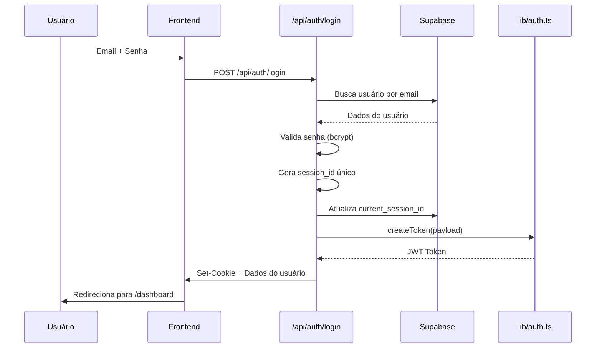

# 📚 Documentação Completa do MeuDashboard

## 📋 Índice

1. [Visão Geral](#visão-geral)
2. [Arquitetura do Sistema](#arquitetura-do-sistema)
3. [Sistema de Autenticação e Autorização](#sistema-de-autenticação-e-autorização)
4. [Hierarquia e Grupos](#hierarquia-e-grupos)
5. [Módulos do Sistema](#módulos-do-sistema)
6. [APIs do Sistema](#apis-do-sistema)
7. [Rotas e Páginas](#rotas-e-páginas)
8. [Banco de Dados](#banco-de-dados)
9. [Integração com Power BI](#integração-com-power-bi)
10. [Sistema de Alertas](#sistema-de-alertas)
11. [Integração WhatsApp](#integração-whatsapp)
12. [Inteligência Artificial](#inteligência-artificial)

---

## 🎯 Visão Geral

O **MeuDashboard** é uma plataforma SaaS multi-tenant que integra:
- **Power BI** - Dashboards interativos
- **WhatsApp** - Comunicação e notificações
- **Alertas Inteligentes** - Monitoramento automatizado de dados
- **IA Contextual** - Assistente inteligente para análise de dados

### Tecnologias Principais
- **Frontend:** Next.js 15 (App Router), React, TypeScript, Tailwind CSS
- **Backend:** Next.js API Routes, Server Actions
- **Banco de Dados:** Supabase (PostgreSQL)
- **Autenticação:** JWT + Cookies HTTP-Only
- **IA:** Anthropic Claude (Sonnet 4)
- **Integrações:** Power BI API, Evolution API (WhatsApp)

---

## 🏗️ Arquitetura do Sistema

### Estrutura de Pastas

```
meudahsboard/
├── app/                          # Next.js App Router
│   ├── api/                      # API Routes (Backend)
│   │   ├── auth/                 # Autenticação
│   │   ├── ai/                   # Inteligência Artificial
│   │   ├── alertas/              # Sistema de Alertas
│   │   ├── powerbi/              # Integração Power BI
│   │   ├── whatsapp/             # Integração WhatsApp
│   │   ├── company-groups/       # Gestão de Grupos
│   │   ├── modules/              # Módulos do Sistema
│   │   └── plans/                # Planos e Licenciamento
│   │
│   ├── dashboard/                # Página principal
│   ├── login/                    # Página de login
│   ├── perfil/                   # Perfil do usuário
│   ├── configuracoes/            # Configurações gerais
│   ├── powerbi/                  # Gestão Power BI
│   ├── whatsapp/                 # Gestão WhatsApp
│   ├── alertas/                  # Gestão de Alertas
│   └── tela/[id]/                # Visualização de Dashboard
│
├── src/
│   ├── components/               # Componentes React
│   │   ├── dashboard/
│   │   ├── layout/
│   │   ├── ui/
│   │   └── whatsapp/
│   │
│   ├── lib/                      # Bibliotecas e Utilitários
│   │   ├── auth.ts               # Sistema de autenticação
│   │   ├── supabase/
│   │   └── activity-log.ts
│   │
│   ├── types/                    # Definições TypeScript
│   ├── contexts/                 # React Contexts
│   └── hooks/                    # Custom Hooks
│
├── middleware.ts                 # Middleware de proteção de rotas
├── sql/                          # Scripts SQL
└── public/                       # Assets estáticos
```

### Fluxo de Requisição

```
1. Cliente → Requisição HTTP
2. middleware.ts → Valida autenticação JWT
3. API Route / Page → Processa requisição
4. getAuthUser() → Valida sessão no banco
5. Supabase → Consulta/manipula dados
6. Response → Retorna JSON ou HTML
```

---

## 🔐 Sistema de Autenticação e Autorização

### Arquitetura de Autenticação

O sistema utiliza **JWT (JSON Web Tokens)** armazenados em **cookies HTTP-Only** para garantir segurança.

#### Componentes Principais

1. **`src/lib/auth.ts`** - Biblioteca de autenticação
2. **`middleware.ts`** - Proteção de rotas
3. **`app/api/auth/`** - Endpoints de autenticação

### Fluxo de Login



### Sessão Única (Single Session)

O sistema implementa **sessão única**: quando um usuário faz login em um novo dispositivo/navegador, a sessão anterior é automaticamente invalidada.

#### Implementação

**1. Login (`app/api/auth/login/route.ts`):**
```typescript
// Gera novo session_id único
const sessionId = crypto.randomUUID();

// Atualiza o session_id no banco (invalida sessão anterior)
await supabase
  .from('users')
  .update({ current_session_id: sessionId })
  .eq('id', user.id);

// Cria token JWT com session_id
const token = await createToken({
  id: user.id,
  email: user.email,
  is_master: user.is_master,
  session_id: sessionId,  // ← Sessão única
});
```

**2. Validação (`src/lib/auth.ts`):**
```typescript
export async function getAuthUser(): Promise<AuthUser | null> {
  // 1. Valida JWT do cookie
  const payload = await verifyToken(token);
  
  // 2. Busca usuário no banco
  const { data: user } = await supabase
    .from('users')
    .select('id, email, full_name, is_master, status, current_session_id')
    .eq('id', userId)
    .single();
  
  // 3. Verifica se sessão ainda é válida
  if (user.current_session_id !== payload.session_id) {
    return null;  // ← Sessão invalidada por outro login
  }
  
  return user;
}
```

### Middleware de Proteção

**Arquivo:** `middleware.ts`

#### Rotas Públicas (não requerem autenticação)
```typescript
const publicRoutes = [
  '/',                    // Landing page
  '/login',               // Página de login
  '/api/auth/login',      // Endpoint de login
  '/api/auth/logout',     // Endpoint de logout
  '/api/whatsapp/webhook', // Webhooks WhatsApp
  '/api/alertas/cron',    // CRON de alertas
];
```

#### Fluxo de Proteção
```typescript
1. Verifica se rota é pública → Permite passar
2. Verifica cookie auth_token
3. Valida JWT com jwtVerify()
4. Se válido → Permite acesso
5. Se inválido → Redireciona /login ou 401 (API)
```

### Estrutura do Token JWT

```json
{
  "id": "uuid-do-usuario",
  "email": "usuario@exemplo.com",
  "is_master": false,
  "session_id": "uuid-da-sessao",
  "iat": 1234567890,
  "exp": 1234567890
}
```

### Cookies de Autenticação

```typescript
Cookie: auth_token
- HttpOnly: true          // Não acessível via JavaScript
- Secure: true (prod)     // HTTPS apenas em produção
- SameSite: Lax           // Proteção CSRF
- Max-Age: 7 dias         // Expiração
- Domain: .meudashboard.org (prod)  // Funciona em subdomínios
- Path: /                 // Toda aplicação
```

### Status de Usuário

```typescript
type UserStatus = 'active' | 'suspended' | 'pending';

// active: Usuário ativo, pode fazer login
// suspended: Conta suspensa, login bloqueado
// pending: Aguardando ativação (novo usuário)
```

### Funções Principais

#### `createToken(payload: JWTPayload): Promise<string>`
Cria um token JWT assinado com HS256.

#### `verifyToken(token: string): Promise<JWTPayload | null>`
Verifica e decodifica um token JWT.

#### `setAuthCookie(token: string): Promise<void>`
Define o cookie de autenticação com configurações de segurança.

#### `removeAuthCookie(): Promise<void>`
Remove o cookie de autenticação (logout).

#### `getAuthUser(): Promise<AuthUser | null>`
Retorna o usuário autenticado atual ou null.

---

## 👥 Hierarquia e Grupos

### Estrutura Hierárquica

O sistema utiliza uma arquitetura **multi-tenant** baseada em:

```
Plano (Plan)
    ↓
Grupo de Empresas (Company Group)
    ↓
Usuários (Users)
    ↓
Membros (User Group Memberships)
```

### 1. Planos (PowerBI Plans)

Define os limites e recursos disponíveis para um grupo.

#### Estrutura da Tabela `powerbi_plans`

```sql
CREATE TABLE powerbi_plans (
  id UUID PRIMARY KEY,
  name TEXT NOT NULL,                    -- Nome do plano
  description TEXT,                      -- Descrição
  max_daily_refreshes INTEGER,           -- Limite de atualizações/dia
  max_powerbi_screens INTEGER,           -- Máx. de telas Power BI
  max_users INTEGER,                     -- Máx. de usuários
  max_companies INTEGER,                 -- Máx. de empresas
  is_active BOOLEAN DEFAULT true,
  display_order INTEGER DEFAULT 0,
  created_at TIMESTAMP,
  updated_at TIMESTAMP
);
```

#### Planos Padrão

| Plano | Atualizações/dia | Telas | Usuários | Empresas |
|-------|-----------------|-------|----------|----------|
| **Básico** | 5 | 3 | 5 | 1 |
| **Profissional** | 20 | 10 | 20 | 5 |
| **Enterprise** | 999 | 999 | 999 | 999 |

### 2. Grupos de Empresas (Company Groups)

Cada grupo representa uma **organização/cliente** na plataforma.

#### Estrutura da Tabela `company_groups`

```sql
CREATE TABLE company_groups (
  id UUID PRIMARY KEY,
  name TEXT NOT NULL,                    -- Nome do grupo
  slug TEXT UNIQUE,                      -- Identificador único
  description TEXT,                      -- Descrição
  logo_url TEXT,                         -- Logo do grupo
  status TEXT DEFAULT 'active',          -- active | suspended | trial
  plan_id UUID REFERENCES powerbi_plans(id),
  max_users INTEGER DEFAULT 10,          -- Limite de usuários
  max_companies INTEGER DEFAULT 2,       -- Limite de empresas
  created_at TIMESTAMP,
  updated_at TIMESTAMP
);
```

#### Status de Grupo

- **`active`**: Grupo ativo e funcional
- **`suspended`**: Grupo suspenso (usuários não conseguem acessar)
- **`trial`**: Período de teste

### 3. Usuários (Users)

Representa pessoas que acessam o sistema.

#### Estrutura da Tabela `users`

```sql
CREATE TABLE users (
  id UUID PRIMARY KEY,
  email TEXT UNIQUE NOT NULL,            -- Email (login)
  password_hash TEXT NOT NULL,           -- Senha criptografada (bcrypt)
  full_name TEXT,                        -- Nome completo
  is_master BOOLEAN DEFAULT false,       -- Super admin do sistema
  status TEXT DEFAULT 'active',          -- active | suspended | pending
  avatar_url TEXT,                       -- URL do avatar
  current_session_id UUID,               -- Sessão ativa (login único)
  last_login_at TIMESTAMP,               -- Último login
  created_at TIMESTAMP,
  updated_at TIMESTAMP
);
```

#### Tipos de Usuário

**1. Usuário Master (`is_master: true`)**
- Super administrador do sistema
- Acesso total a todas as funcionalidades
- Gerencia grupos, planos e módulos
- **Único** usuário que não está vinculado a um grupo específico

**2. Usuário Regular (`is_master: false`)**
- Vinculado a um ou mais grupos via `user_group_memberships`
- Acesso baseado em role e módulos habilitados
- Limitações definidas pelo plano do grupo

### 4. Membros de Grupo (User Group Memberships)

Define o vínculo entre usuários e grupos, incluindo permissões.

#### Estrutura da Tabela `user_group_memberships`

```sql
CREATE TABLE user_group_memberships (
  id UUID PRIMARY KEY,
  user_id UUID REFERENCES users(id) ON DELETE CASCADE,
  company_group_id UUID REFERENCES company_groups(id) ON DELETE CASCADE,
  role TEXT NOT NULL,                    -- admin | manager | operator | viewer
  is_active BOOLEAN DEFAULT true,
  created_at TIMESTAMP,
  updated_at TIMESTAMP,
  UNIQUE(user_id, company_group_id)
);
```

#### Roles (Papéis)

| Role | Descrição | Permissões |
|------|-----------|------------|
| **admin** | Administrador do Grupo | Gerencia usuários, configurações, módulos |
| **manager** | Gerente | Cria e gerencia alertas, telas, relatórios |
| **operator** | Operador | Visualiza e executa alertas/relatórios |
| **viewer** | Visualizador | Apenas visualização de dashboards |

### Fluxo de Permissões

```
1. Usuário faz login
2. Sistema busca company_group via user_group_memberships
3. Valida role do usuário no grupo
4. Carrega módulos habilitados para o grupo (module_groups)
5. Aplica limites do plano
6. Usuário acessa apenas recursos permitidos
```

### Exemplo Prático de Hierarquia

```
📦 Plano Profissional
    ├─ 🏢 Grupo: Empresa XYZ Ltda
    │   ├─ 👤 João Silva (admin)
    │   ├─ 👤 Maria Santos (manager)
    │   ├─ 👤 Pedro Costa (operator)
    │   │
    │   ├─ 📊 Módulos habilitados:
    │   │   ├─ ✅ Power BI
    │   │   ├─ ✅ WhatsApp
    │   │   └─ ✅ Alertas
    │   │
    │   └─ 📈 Limites:
    │       ├─ Atualizações/dia: 20
    │       ├─ Telas Power BI: 10
    │       └─ Usuários: 20
    │
    └─ 🏢 Grupo: Empresa ABC S/A
        ├─ 👤 Ana Oliveira (admin)
        └─ 👤 Carlos Pereira (viewer)
```

### APIs de Gestão de Grupos

#### `GET /api/company-groups`
Lista todos os grupos (apenas para usuários autenticados).

**Resposta:**
```json
{
  "groups": [
    {
      "id": "uuid",
      "name": "Empresa XYZ Ltda"
    }
  ]
}
```

---

## 🧩 Módulos do Sistema

O sistema é **modular**, permitindo ativar/desativar funcionalidades por grupo.

### Estrutura de Módulos

#### Tabela `modules`

```sql
CREATE TABLE modules (
  id UUID PRIMARY KEY,
  name TEXT UNIQUE NOT NULL,             -- Identificador único (powerbi, whatsapp, etc)
  display_name TEXT NOT NULL,            -- Nome exibido
  description TEXT,                      -- Descrição do módulo
  icon TEXT NOT NULL,                    -- Ícone Lucide React
  is_enabled BOOLEAN DEFAULT true,       -- Módulo ativo no sistema
  sort_order INTEGER DEFAULT 0,          -- Ordem de exibição
  created_at TIMESTAMP,
  updated_at TIMESTAMP
);
```

#### Tabela `module_groups` (Associação Módulo ↔ Grupo)

```sql
CREATE TABLE module_groups (
  id UUID PRIMARY KEY,
  module_id UUID REFERENCES modules(id) ON DELETE CASCADE,
  company_group_id UUID REFERENCES company_groups(id) ON DELETE CASCADE,
  created_at TIMESTAMP,
  UNIQUE(module_id, company_group_id)
);
```

### Módulos Padrão

| Nome | Display Name | Ícone | Descrição |
|------|-------------|-------|-----------|
| **powerbi** | Power BI | BarChart3 | Dashboards e relatórios interativos |
| **whatsapp** | WhatsApp | MessageCircle | Integração e gestão de mensagens |
| **alertas** | Alertas | Bell | Sistema de alertas automáticos |
| **ia** | Inteligência Artificial | Bot | Assistente de IA contextual |

### Como Funciona

1. **Administrador Master** define quais módulos existem no sistema
2. **Administrador do Grupo** ativa/desativa módulos para seu grupo
3. **Sistema** exibe apenas módulos ativos para o grupo do usuário
4. **Navegação** é gerada dinamicamente baseada nos módulos habilitados

### APIs de Módulos

#### `GET /api/modules`
Lista todos os módulos disponíveis.

#### `GET /api/modules/group/:groupId`
Lista módulos habilitados para um grupo específico.

#### `POST /api/modules/group/:groupId/toggle`
Ativa/desativa um módulo para um grupo.

**Body:**
```json
{
  "module_id": "uuid-do-modulo",
  "enabled": true
}
```

---

## 🔌 APIs do Sistema

### Estrutura de APIs

Todas as APIs seguem padrões RESTful e estão organizadas por domínio.

### Padrões de Resposta

#### Sucesso (200/201)
```json
{
  "success": true,
  "data": {},
  "message": "Operação realizada com sucesso"
}
```

#### Erro (400/401/403/500)
```json
{
  "success": false,
  "error": "Mensagem de erro",
  "details": {}
}
```

---

### 🔐 APIs de Autenticação

**Base Path:** `/api/auth`

#### `POST /api/auth/login`
Autentica um usuário no sistema.

**Request:**
```json
{
  "email": "usuario@exemplo.com",
  "password": "senha123"
}
```

**Response (200):**
```json
{
  "success": true,
  "message": "Login realizado",
  "user": {
    "id": "uuid",
    "email": "usuario@exemplo.com",
    "full_name": "João Silva",
    "is_master": false,
    "status": "active",
    "avatar_url": "https://..."
  }
}
```

**Comportamento:**
- Valida credenciais com bcrypt
- Gera `session_id` único (invalida sessões anteriores)
- Cria token JWT com expiração de 7 dias
- Define cookie HTTP-Only
- Registra log de atividade

---

#### `POST /api/auth/logout`
Faz logout do usuário.

**Response (200):**
```json
{
  "success": true,
  "message": "Logout realizado"
}
```

**Comportamento:**
- Remove cookie de autenticação
- Registra log de atividade

---

#### `GET /api/auth/me`
Retorna dados do usuário autenticado.

**Response (200):**
```json
{
  "user": {
    "id": "uuid",
    "email": "usuario@exemplo.com",
    "full_name": "João Silva",
    "is_master": false,
    "status": "active",
    "avatar_url": "https://..."
  }
}
```

---

### 🤖 APIs de Inteligência Artificial

**Base Path:** `/api/ai`

#### `POST /api/ai/generate-dax`
Gera query DAX baseada em descrição em linguagem natural.

**Request:**
```json
{
  "prompt": "Venda de ontem por filial",
  "connection_id": "uuid",
  "dataset_id": "uuid"
}
```

**Response (200):**
```json
{
  "success": true,
  "dax_query": "EVALUATE\nROW(\"Valor\", CALCULATE([QA_Faturamento], Calendario[Data] = TODAY() - 1))",
  "description": "Total de vendas do dia anterior"
}
```

---

#### `POST /api/ai/generate-alert`
Gera DAX + Template de mensagem juntos.

**Request:**
```json
{
  "prompt": "Faturamento por filial dos últimos 3 dias com total",
  "connection_id": "uuid",
  "dataset_id": "uuid",
  "alert_name": "Meu Alerta",
  "alert_type": "scheduled_report"
}
```

**Response (200):**
```json
{
  "success": true,
  "dax_query": "EVALUATE\nUNION(...)",
  "message_template": "📊 *{{nome_alerta}}*\n\n🏢 *Faturamento por Filial:*\n\n{{valor}}\n\n📅 {{data}} às {{hora}}",
  "description": "Faturamento dos últimos 3 dias agrupado por filial com total"
}
```

---

#### `POST /api/ai/chat`
Conversa com assistente de IA contextual sobre dados de uma tela Power BI.

**Request:**
```json
{
  "screen_id": "uuid",
  "messages": [
    {
      "role": "user",
      "content": "Qual foi o faturamento total de ontem?"
    }
  ]
}
```

**Response (200 - Streaming):**
```
data: {"type":"text","content":"O faturamento..."}
data: {"type":"done"}
```

---

### 🔔 APIs de Alertas

**Base Path:** `/api/alertas`

#### `GET /api/alertas`
Lista todos os alertas do usuário.

**Response (200):**
```json
{
  "alertas": [
    {
      "id": "uuid",
      "name": "Vendas Diárias",
      "description": "Alerta de vendas",
      "alert_type": "scheduled_report",
      "is_active": true,
      "created_at": "2024-01-01T10:00:00Z"
    }
  ]
}
```

---

#### `POST /api/alertas`
Cria um novo alerta.

**Request:**
```json
{
  "name": "Vendas Diárias",
  "description": "Alertas de vendas por filial",
  "connection_id": "uuid",
  "dataset_id": "uuid",
  "dax_query": "EVALUATE...",
  "message_template": "📊 *{{nome_alerta}}*\n\n{{valor}}",
  "alert_type": "scheduled_report",
  "condition": "greater_than",
  "threshold": 10000,
  "check_frequency": "daily",
  "check_times": ["08:00", "18:00"],
  "notify_whatsapp": true,
  "whatsapp_numbers": ["5562982289559"],
  "whatsapp_group_ids": []
}
```

---

#### `PUT /api/alertas`
Atualiza um alerta existente.

---

#### `DELETE /api/alertas/:id`
Remove um alerta.

---

#### `POST /api/alertas/:id/trigger`
Dispara um alerta manualmente (teste).

**Response (200):**
```json
{
  "success": true,
  "message": "Alerta disparado com sucesso",
  "results": {
    "numbers": [
      {"phone": "5562982289559", "success": true}
    ],
    "groups": []
  }
}
```

---

#### `GET /api/alertas/:id/historico`
Histórico de execuções de um alerta.

**Response (200):**
```json
{
  "historico": [
    {
      "id": "uuid",
      "alert_id": "uuid",
      "executed_at": "2024-01-09T08:00:00Z",
      "status": "success",
      "dax_result": {...},
      "message_sent": true
    }
  ]
}
```

---

#### `GET /api/alertas/cron`
**CRON Job** - Executado automaticamente pelo Vercel Cron.

**Autenticação:**
- Query param: `?key=CRON_SECRET`
- Header: `Authorization: Bearer CRON_SECRET`

**Comportamento:**
1. Busca todos os alertas ativos
2. Verifica horários de execução
3. Executa DAX no Power BI
4. Avalia condições
5. Envia mensagens WhatsApp
6. Registra histórico

---

### 📊 APIs do Power BI

**Base Path:** `/api/powerbi`

#### `GET /api/powerbi/connections`
Lista conexões Power BI.

---

#### `POST /api/powerbi/connections`
Cria nova conexão Power BI.

**Request:**
```json
{
  "name": "Power BI Produção",
  "tenant_id": "tenant-id",
  "client_id": "client-id",
  "client_secret": "client-secret",
  "workspace_id": "workspace-id"
}
```

---

#### `GET /api/powerbi/datasets`
Lista datasets de uma conexão.

---

#### `POST /api/powerbi/execute-dax`
Executa uma query DAX.

**Request:**
```json
{
  "connection_id": "uuid",
  "dataset_id": "dataset-id",
  "query": "EVALUATE ROW(\"Valor\", [Medida])"
}
```

**Response (200):**
```json
{
  "success": true,
  "results": [
    {"Valor": 15000}
  ]
}
```

---

#### `POST /api/powerbi/embed-token`
Gera token de embed para visualização de relatório.

**Request:**
```json
{
  "report_id": "report-id",
  "workspace_id": "workspace-id"
}
```

**Response (200):**
```json
{
  "embedToken": "H4sIAA...",
  "embedUrl": "https://app.powerbi.com/reportEmbed?...",
  "reportId": "report-id",
  "expiration": "2024-01-09T10:00:00Z"
}
```

---

### 📱 APIs do WhatsApp

**Base Path:** `/api/whatsapp`

#### `GET /api/whatsapp/instances`
Lista instâncias WhatsApp (Evolution API).

---

#### `POST /api/whatsapp/instances`
Cria nova instância WhatsApp.

---

#### `GET /api/whatsapp/groups`
Lista grupos WhatsApp.

---

#### `POST /api/whatsapp/send-message`
Envia mensagem WhatsApp.

**Request:**
```json
{
  "instance_id": "uuid",
  "number": "5562982289559",
  "message": "Olá, esta é uma mensagem de teste!"
}
```

---

#### `POST /api/whatsapp/webhook`
Webhook para receber mensagens do Evolution API.

---

### 🏢 APIs de Gestão

#### `GET /api/company-groups`
Lista grupos de empresas.

---

#### `GET /api/user`
Dados do usuário autenticado (incluindo grupos e permissões).

**Response (200):**
```json
{
  "user": {
    "id": "uuid",
    "email": "usuario@exemplo.com",
    "full_name": "João Silva",
    "is_master": false,
    "groups": [
      {
        "id": "uuid",
        "name": "Empresa XYZ",
        "role": "admin"
      }
    ]
  }
}
```

---

## 🗺️ Rotas e Páginas

### Páginas Públicas

| Rota | Descrição |
|------|-----------|
| `/` | Landing page (página inicial pública) |
| `/login` | Página de login |

### Páginas Protegidas

#### Dashboard e Navegação

| Rota | Descrição | Permissões |
|------|-----------|------------|
| `/dashboard` | Página principal do sistema | Todos usuários |
| `/perfil` | Perfil do usuário | Todos usuários |
| `/trocar-senha` | Alteração de senha | Todos usuários |

#### Power BI

| Rota | Descrição | Permissões |
|------|-----------|------------|
| `/powerbi` | Gestão Power BI (hub) | Módulo Power BI habilitado |
| `/powerbi/conexoes` | Conexões Power BI | Admin do grupo |
| `/powerbi/telas` | Telas cadastradas | Manager+ |
| `/powerbi/gateways` | Gateways on-premise | Admin do grupo |
| `/powerbi/relatorios` | Relatórios Power BI | Manager+ |
| `/powerbi/contextos` | Contextos de IA | Manager+ |
| `/powerbi/ordem-atualizacao` | Ordem de atualização | Admin do grupo |
| `/tela/[id]` | Visualização de dashboard | Viewer+ |

#### WhatsApp

| Rota | Descrição | Permissões |
|------|-----------|------------|
| `/whatsapp` | Gestão WhatsApp (hub) | Módulo WhatsApp habilitado |
| `/whatsapp/instancias` | Instâncias Evolution API | Admin do grupo |
| `/whatsapp/grupos` | Grupos WhatsApp | Manager+ |
| `/whatsapp/numeros` | Números cadastrados | Manager+ |
| `/whatsapp/mensagens` | Histórico de mensagens | Manager+ |
| `/whatsapp/webhook` | Configuração webhook | Admin do grupo |

#### Alertas

| Rota | Descrição | Permissões |
|------|-----------|------------|
| `/alertas` | Lista de alertas | Módulo Alertas habilitado |
| `/alertas/novo` | Criar novo alerta | Manager+ |
| `/alertas/[id]` | Editar alerta | Manager+ |
| `/alertas/historico` | Histórico de execuções | Operator+ |

#### Configurações

| Rota | Descrição | Permissões |
|------|-----------|------------|
| `/configuracoes` | Configurações gerais | Admin do grupo |
| `/configuracoes/grupos` | Gestão de grupos | Master |
| `/configuracoes/modulos` | Gestão de módulos | Master |
| `/configuracoes/planos` | Gestão de planos | Master |
| `/configuracoes/logs` | Logs de atividade | Admin do grupo |

---

## 🗄️ Banco de Dados

### Tabelas Principais

#### Autenticação e Usuários

**`users`** - Usuários do sistema
```sql
id, email, password_hash, full_name, is_master, status, 
avatar_url, current_session_id, last_login_at, created_at, updated_at
```

**`user_group_memberships`** - Vínculo usuário ↔ grupo
```sql
id, user_id, company_group_id, role, is_active, created_at, updated_at
```

#### Grupos e Planos

**`company_groups`** - Grupos de empresas
```sql
id, name, slug, description, logo_url, status, plan_id,
max_users, max_companies, created_at, updated_at
```

**`powerbi_plans`** - Planos de licenciamento
```sql
id, name, description, max_daily_refreshes, max_powerbi_screens,
max_users, max_companies, is_active, display_order, created_at, updated_at
```

#### Módulos

**`modules`** - Módulos do sistema
```sql
id, name, display_name, description, icon, is_enabled, sort_order, created_at, updated_at
```

**`module_groups`** - Módulos habilitados por grupo
```sql
id, module_id, company_group_id, created_at
```

#### Power BI

**`powerbi_connections`** - Conexões com Power BI
```sql
id, company_group_id, name, tenant_id, client_id, client_secret,
workspace_id, is_active, created_at, updated_at
```

**`powerbi_screens`** - Telas/Dashboards
```sql
id, company_group_id, connection_id, name, description, report_id,
default_page, show_page_navigation, screen_icon, sort_order,
is_public, created_at, updated_at
```

**`ai_model_contexts`** - Contextos de IA
```sql
id, connection_id, dataset_id, context_content, is_active, created_at, updated_at
```

**`powerbi_refresh_order`** - Ordem de atualização
```sql
id, company_group_id, connection_id, dataset_id, refresh_order,
is_enabled, last_refresh_at, created_at, updated_at
```

#### WhatsApp

**`whatsapp_instances`** - Instâncias Evolution API
```sql
id, company_group_id, instance_name, api_url, api_key,
is_connected, phone_number, created_at, updated_at
```

**`whatsapp_groups`** - Grupos WhatsApp
```sql
id, company_group_id, group_id, group_name, description,
is_active, created_at, updated_at
```

**`whatsapp_numbers`** - Números cadastrados
```sql
id, company_group_id, phone_number, contact_name, description,
is_active, created_at, updated_at
```

#### Alertas

**`alertas`** - Alertas configurados
```sql
id, company_group_id, name, description, connection_id, dataset_id,
dax_query, message_template, alert_type, condition, threshold,
check_frequency, check_times, check_days_of_week,
notify_whatsapp, whatsapp_numbers, whatsapp_group_ids,
is_active, created_at, updated_at
```

**`alerta_historico`** - Histórico de execuções
```sql
id, alert_id, executed_at, status, dax_result, dax_error,
condition_met, message_sent, whatsapp_sent_to, error_message,
created_at
```

#### Logs

**`activity_logs`** - Logs de atividade
```sql
id, user_id, company_group_id, action_type, module, description,
entity_type, entity_id, metadata, ip_address, user_agent, created_at
```

---

## 📊 Integração com Power BI

### Autenticação Service Principal

O sistema usa **Service Principal (Azure AD App)** para autenticação com Power BI.

#### Credenciais Necessárias

```typescript
{
  tenant_id: "UUID do Tenant Azure AD",
  client_id: "UUID do App Registration",
  client_secret: "Secret do App",
  workspace_id: "UUID do Workspace Power BI"
}
```

### Fluxo de Autenticação

```
1. Obter Access Token
   POST https://login.microsoftonline.com/{tenant_id}/oauth2/v2.0/token
   Body: grant_type=client_credentials
         client_id={client_id}
         client_secret={client_secret}
         scope=https://analysis.windows.net/powerbi/api/.default

2. Usar Access Token
   Authorization: Bearer {access_token}
```

### Execução de DAX

```typescript
POST https://api.powerbi.com/v1.0/myorg/groups/{workspace_id}/datasets/{dataset_id}/executeQueries
Headers: Authorization: Bearer {token}
Body: {
  "queries": [{
    "query": "EVALUATE ROW(\"Valor\", [Medida])"
  }],
  "serializerSettings": {
    "includeNulls": true
  }
}
```

### Geração de Embed Token

```typescript
POST https://api.powerbi.com/v1.0/myorg/groups/{workspace_id}/reports/{report_id}/GenerateToken
Body: {
  "accessLevel": "View",
  "allowSaveAs": false
}

Response: {
  "token": "H4sIAA...",
  "tokenId": "uuid",
  "expiration": "2024-01-09T10:00:00Z"
}
```

### Visualização de Relatório

O frontend usa **PowerBI JavaScript SDK** para embed:

```typescript
import { models, Report, service } from 'powerbi-client';

const powerbi = new service.Service(...)
const report = powerbi.embed(embedContainer, {
  type: 'report',
  embedUrl: 'https://app.powerbi.com/reportEmbed?...',
  accessToken: 'H4sIAA...',
  settings: {
    filterPaneEnabled: false,
    navContentPaneEnabled: true,
  }
});
```

---

## 🔔 Sistema de Alertas

### Funcionamento

O sistema de alertas monitora dados do Power BI e dispara notificações WhatsApp automaticamente.

### Tipos de Alerta (`alert_type`)

| Tipo | Descrição |
|------|-----------|
| **threshold** | Limite - dispara quando valor ultrapassa limite |
| **anomaly** | Anomalia - detecta valores fora do padrão |
| **comparison** | Comparação - compara períodos ou valores |
| **goal** | Meta - acompanha atingimento de metas |
| **scheduled_report** | Relatório programado - envia dados periodicamente |

### Condições (`condition`)

- `greater_than` - Maior que
- `less_than` - Menor que
- `equals` - Igual a
- `not_equals` - Diferente de
- `greater_or_equal` - Maior ou igual
- `less_or_equal` - Menor ou igual

### Frequências de Verificação (`check_frequency`)

- `daily` - Diário
- `weekly` - Semanal
- `monthly` - Mensal
- `custom` - Personalizado

### Variáveis de Template

As mensagens suportam variáveis dinâmicas:

- `{{nome_alerta}}` - Nome do alerta
- `{{valor}}` - Resultado da query DAX (formatado)
- `{{data}}` - Data da execução
- `{{hora}}` - Hora da execução
- `{{condicao}}` - Condição configurada
- `{{threshold}}` - Valor limite

### Formatação de Resultados

Quando a DAX retorna múltiplas linhas (tabela), o sistema formata automaticamente:

**Entrada:**
```json
[
  { "Filial": "Centro", "Valor": 31107.46 },
  { "Filial": "Sul", "Valor": 13323.70 },
  { "Filial": "TOTAL", "Valor": 44431.16 }
]
```

**Saída (WhatsApp):**
```
Centro: R$ 31.107,46
Sul: R$ 13.323,70
━━━━━━━━━━━━━━
*TOTAL*: R$ 44.431,16
```

### CRON de Alertas

Executado automaticamente pelo **Vercel Cron** a cada hora:

```json
// vercel.json
{
  "crons": [{
    "path": "/api/alertas/cron",
    "schedule": "0 * * * *"
  }]
}
```

**Fluxo:**
1. Verifica alertas ativos
2. Filtra por horário de execução
3. Executa DAX no Power BI
4. Avalia condições
5. Formata mensagem
6. Envia WhatsApp
7. Registra histórico

---

## 📱 Integração WhatsApp

### Evolution API

O sistema utiliza **Evolution API v2** para integração com WhatsApp.

### Formato de Mensagens

```json
{
  "number": "5562982289559",
  "text": "Mensagem aqui"
}
```

### Envio de Mensagens

**Para números individuais:**
```
POST {api_url}/message/sendText/{instance_name}
Headers: apikey: {api_key}
Body: {
  "number": "5562982289559",
  "text": "Olá!"
}
```

**Para grupos:**
```
POST {api_url}/message/sendText/{instance_name}
Headers: apikey: {api_key}
Body: {
  "number": "120363123456789@g.us",
  "text": "Olá grupo!"
}
```

### Webhook

O sistema recebe mensagens via webhook:

```
POST /api/whatsapp/webhook
Headers: apikey: {api_key}
Body: {
  "event": "messages.upsert",
  "instance": "instance-name",
  "data": {...}
}
```

---

## 🤖 Inteligência Artificial

### Modelo

**Anthropic Claude Sonnet 4** (`claude-sonnet-4-20250514`)

### Geração de DAX

O sistema usa IA para converter descrições em linguagem natural para queries DAX:

**Entrada:**
```
"Quero o faturamento por filial dos últimos 3 dias com total no final"
```

**Saída:**
```dax
EVALUATE
UNION(
    ADDCOLUMNS(
        VALUES(Empresa[Filial]),
        "Valor", CALCULATE([QA_Faturamento], 
          Calendario[Data] >= TODAY() - 3, 
          Calendario[Data] < TODAY())
    ),
    ROW("Filial", "TOTAL", "Valor", 
      CALCULATE([QA_Faturamento], 
        Calendario[Data] >= TODAY() - 3, 
        Calendario[Data] < TODAY(), 
        ALL(Empresa)))
)
ORDER BY [Valor] DESC
```

### Contexto do Modelo

O sistema usa **contextos específicos** para cada dataset, contendo:
- Tabelas disponíveis
- Medidas calculadas
- Relacionamentos
- Descrições de campos

Isso permite que a IA gere DAX precisa e válida.

### Chat Contextual

O assistente de IA tem acesso ao contexto da tela Power BI que o usuário está visualizando, permitindo perguntas como:

- "Qual foi o faturamento total de ontem?"
- "Qual filial vendeu mais?"
- "Me mostre a comparação com o mês passado"

---

## 🔧 Configurações e Variáveis de Ambiente

### Variáveis Necessárias

```env
# JWT
JWT_SECRET=chave-secreta-jwt-256-bits

# Supabase
NEXT_PUBLIC_SUPABASE_URL=https://xxx.supabase.co
NEXT_PUBLIC_SUPABASE_ANON_KEY=eyJ...
SUPABASE_SERVICE_ROLE_KEY=eyJ...

# Anthropic (IA)
ANTHROPIC_API_KEY=sk-ant-...

# CRON
CRON_SECRET=chave-secreta-cron

# Produção
NODE_ENV=production
```

---

## 📄 Licença

© 2024 MeuDashboard. Todos os direitos reservados.
