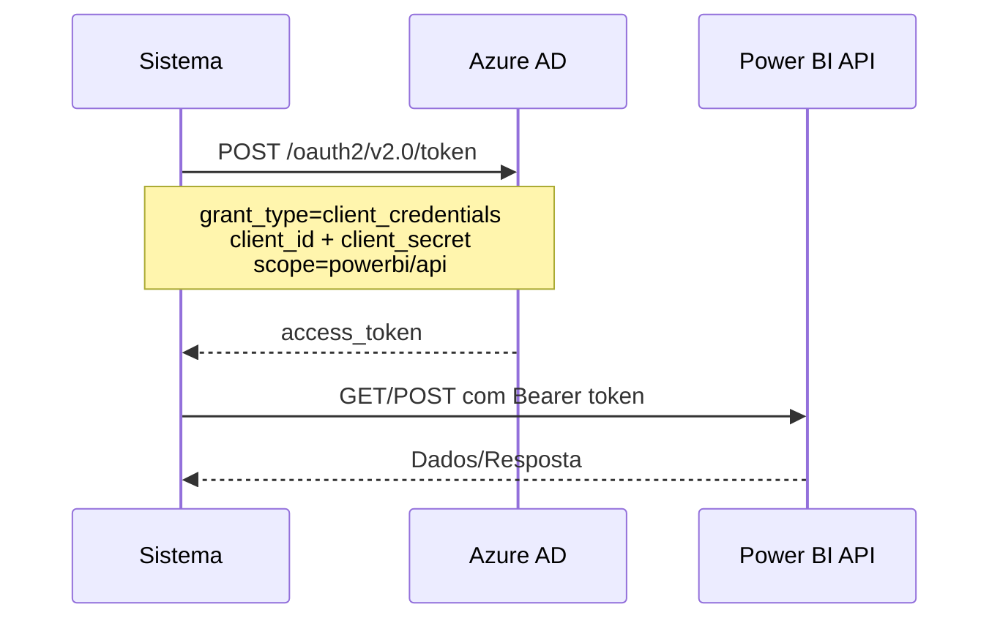

# 📊 Documentação Completa - Conexões Power BI

## 📋 Índice

1. [Visão Geral](#visão-geral)
2. [Estrutura de Dados](#estrutura-de-dados)
3. [APIs Disponíveis](#apis-disponíveis)
4. [Autenticação Power BI](#autenticação-power-bi)
5. [Interface de Usuário](#interface-de-usuário)
6. [Funcionalidades](#funcionalidades)
7. [Integrações](#integrações)
8. [Segurança e Permissões](#segurança-e-permissões)
9. [Exemplos de Uso](#exemplos-de-uso)

---

## 🎯 Visão Geral

As **Conexões Power BI** são configurações que permitem ao sistema se conectar e interagir com workspaces do Power BI através da API REST. Cada conexão armazena as credenciais necessárias para autenticação (Service Principal) e está vinculada a um grupo de empresa (`company_group_id`).

### Objetivo Principal

- **Autenticação**: Gerenciar credenciais de Service Principal do Azure AD
- **Workspace**: Associar cada conexão a um workspace específico do Power BI
- **Isolamento**: Separar conexões por grupo de empresa
- **Reutilização**: Usar a mesma conexão em múltiplos relatórios, datasets e funcionalidades

---

## 🗄️ Estrutura de Dados

### Tabela: `powerbi_connections`

```sql
CREATE TABLE powerbi_connections (
  id UUID PRIMARY KEY DEFAULT gen_random_uuid(),
  company_group_id UUID NOT NULL REFERENCES company_groups(id) ON DELETE CASCADE,
  name TEXT NOT NULL,
  tenant_id TEXT NOT NULL,              -- UUID do Tenant Azure AD
  client_id TEXT NOT NULL,               -- UUID do App Registration
  client_secret TEXT NOT NULL,           -- Secret do App (criptografado)
  workspace_id TEXT NOT NULL,            -- UUID do Workspace Power BI
  show_page_navigation BOOLEAN DEFAULT true,
  is_active BOOLEAN DEFAULT true,
  created_at TIMESTAMP DEFAULT NOW(),
  updated_at TIMESTAMP DEFAULT NOW()
);

-- Índices
CREATE INDEX idx_powerbi_connections_group_id ON powerbi_connections(company_group_id);
CREATE INDEX idx_powerbi_connections_is_active ON powerbi_connections(is_active);
CREATE INDEX idx_powerbi_connections_workspace_id ON powerbi_connections(workspace_id);
```

### Campos Principais

| Campo | Tipo | Descrição |
|-------|------|-----------|
| `id` | UUID | Identificador único da conexão |
| `company_group_id` | UUID | Grupo de empresa ao qual pertence |
| `name` | TEXT | Nome descritivo da conexão |
| `tenant_id` | TEXT | ID do Tenant Azure AD (ex: `12345678-1234-1234-1234-123456789012`) |
| `client_id` | TEXT | ID do App Registration no Azure AD |
| `client_secret` | TEXT | Secret do App (armazenado de forma segura) |
| `workspace_id` | TEXT | ID do Workspace Power BI (GUID) |
| `show_page_navigation` | BOOLEAN | Se deve mostrar navegação de páginas nos relatórios embedados |
| `is_active` | BOOLEAN | Se a conexão está ativa e pode ser usada |

### Relacionamentos

```
powerbi_connections
  ├──▶ company_groups (N:1) - Uma conexão pertence a um grupo
  ├──▶ powerbi_reports (1:N) - Uma conexão pode ter múltiplos relatórios
  ├──▶ powerbi_dashboard_screens (1:N via reports) - Telas de dashboard
  ├──▶ alertas (1:N) - Alertas configurados
  └──▶ ai_model_contexts (1:N) - Contextos de IA
```

---

## 🔌 APIs Disponíveis

### Base Path: `/api/powerbi/connections`

### 1. `GET /api/powerbi/connections`

**Descrição**: Lista todas as conexões Power BI disponíveis para o usuário.

**Query Parameters**:
- `group_id` (opcional): Filtrar por grupo específico
- `company_group_id` (opcional): Alias para `group_id`

**Permissões**:
- **Master**: Vê todas as conexões
- **Developer**: Vê apenas conexões dos seus grupos
- **Admin/User**: Vê apenas conexões dos grupos que pertencem

**Response (200)**:
```json
{
  "connections": [
    {
      "id": "uuid",
      "name": "Power BI Produção",
      "tenant_id": "tenant-uuid",
      "client_id": "client-uuid",
      "workspace_id": "workspace-uuid",
      "show_page_navigation": true,
      "is_active": true,
      "company_group": {
        "id": "group-uuid",
        "name": "Grupo A"
      },
      "created_at": "2024-01-01T00:00:00Z",
      "updated_at": "2024-01-01T00:00:00Z"
    }
  ]
}
```

**Exemplo de Uso**:
```typescript
// Buscar todas as conexões
const res = await fetch('/api/powerbi/connections');
const data = await res.json();

// Buscar conexões de um grupo específico
const res = await fetch('/api/powerbi/connections?group_id=uuid-do-grupo');
const data = await res.json();
```

---

### 2. `POST /api/powerbi/connections`

**Descrição**: Cria uma nova conexão Power BI.

**Permissões**:
- **Master**: Pode criar conexão para qualquer grupo
- **Developer**: Pode criar apenas para seus próprios grupos
- **Admin/User**: Sem permissão

**Request Body**:
```json
{
  "company_group_id": "uuid-do-grupo",
  "name": "Power BI Produção",
  "tenant_id": "12345678-1234-1234-1234-123456789012",
  "client_id": "87654321-4321-4321-4321-210987654321",
  "client_secret": "secret-do-app",
  "workspace_id": "workspace-uuid",
  "show_page_navigation": true
}
```

**Campos Obrigatórios**:
- `company_group_id`
- `name`
- `tenant_id`
- `client_id`
- `client_secret`
- `workspace_id`

**Response (201)**:
```json
{
  "connection": {
    "id": "uuid",
    "name": "Power BI Produção",
    "tenant_id": "tenant-uuid",
    "client_id": "client-uuid",
    "workspace_id": "workspace-uuid",
    "show_page_navigation": true,
    "is_active": true,
    "company_group_id": "group-uuid",
    "created_at": "2024-01-01T00:00:00Z",
    "updated_at": "2024-01-01T00:00:00Z"
  }
}
```

**Erros**:
- `400`: Campos obrigatórios faltando
- `403`: Sem permissão ou grupo não pertence ao desenvolvedor
- `500`: Erro ao criar conexão

---

### 3. `GET /api/powerbi/connections/[id]`

**Descrição**: Busca uma conexão específica por ID.

**Response (200)**:
```json
{
  "connection": {
    "id": "uuid",
    "name": "Power BI Produção",
    "tenant_id": "tenant-uuid",
    "client_id": "client-uuid",
    "workspace_id": "workspace-uuid",
    "show_page_navigation": true,
    "is_active": true,
    "company_group": {
      "id": "group-uuid",
      "name": "Grupo A"
    },
    "created_at": "2024-01-01T00:00:00Z",
    "updated_at": "2024-01-01T00:00:00Z"
  }
}
```

**Erros**:
- `404`: Conexão não encontrada

---

### 4. `PUT /api/powerbi/connections/[id]`

**Descrição**: Atualiza uma conexão existente.

**Permissões**:
- **Master**: Pode atualizar qualquer conexão
- **Developer**: Pode atualizar apenas conexões dos seus grupos
- **Admin/User**: Sem permissão

**Request Body** (todos os campos são opcionais):
```json
{
  "name": "Novo Nome",
  "tenant_id": "novo-tenant-id",
  "client_id": "novo-client-id",
  "client_secret": "novo-secret",  // Opcional - se não enviado, mantém o atual
  "workspace_id": "novo-workspace-id",
  "show_page_navigation": false,
  "is_active": false
}
```

**Nota Importante**: Se `client_secret` não for enviado, o valor atual é mantido.

**Response (200)**:
```json
{
  "connection": {
    "id": "uuid",
    "name": "Novo Nome",
    // ... outros campos atualizados
  }
}
```

**Erros**:
- `403`: Sem permissão para editar esta conexão
- `404`: Conexão não encontrada
- `500`: Erro ao atualizar

---

### 5. `DELETE /api/powerbi/connections/[id]`

**Descrição**: Exclui uma conexão Power BI.

**Permissões**:
- **Master**: Pode excluir qualquer conexão
- **Developer**: Pode excluir apenas conexões dos seus grupos
- **Admin/User**: Sem permissão

**Response (200)**:
```json
{
  "success": true
}
```

**Atenção**: A exclusão de uma conexão pode afetar:
- Relatórios vinculados (`powerbi_reports`)
- Telas de dashboard (`powerbi_dashboard_screens`)
- Alertas configurados (`alertas`)
- Contextos de IA (`ai_model_contexts`)

**Erros**:
- `403`: Sem permissão para excluir esta conexão
- `404`: Conexão não encontrada
- `500`: Erro ao excluir

---

## 🔐 Autenticação Power BI

### Service Principal (Azure AD App)

O sistema usa **Service Principal** para autenticação com Power BI. Isso permite autenticação sem interação do usuário.

### Credenciais Necessárias

Para criar uma conexão, você precisa:

1. **Tenant ID**: ID do seu tenant Azure AD
   - Encontrado em: Azure Portal → Azure Active Directory → Overview → Tenant ID

2. **Client ID**: ID do App Registration
   - Criado em: Azure Portal → Azure Active Directory → App registrations
   - Permissões necessárias: Power BI Service API

3. **Client Secret**: Secret do App
   - Criado em: App Registration → Certificates & secrets
   - **Importante**: Anote o valor imediatamente, pois não pode ser recuperado depois

4. **Workspace ID**: ID do Workspace Power BI
   - Encontrado em: Power BI Service → Workspace → Settings → Workspace ID

### Fluxo de Autenticação



### Implementação no Código

```typescript
// 1. Obter Access Token
const tokenUrl = `https://login.microsoftonline.com/${connection.tenant_id}/oauth2/v2.0/token`;
const tokenResponse = await fetch(tokenUrl, {
  method: 'POST',
  headers: { 'Content-Type': 'application/x-www-form-urlencoded' },
  body: new URLSearchParams({
    grant_type: 'client_credentials',
    client_id: connection.client_id,
    client_secret: connection.client_secret,
    scope: 'https://analysis.windows.net/powerbi/api/.default',
  }),
});

const tokenData = await tokenResponse.json();
const accessToken = tokenData.access_token;

// 2. Usar Access Token nas requisições
const apiResponse = await fetch(`https://api.powerbi.com/v1.0/myorg/groups/${workspace_id}/...`, {
  headers: {
    'Authorization': `Bearer ${accessToken}`,
  },
});
```

### Permissões Necessárias no Azure AD

O Service Principal precisa das seguintes permissões:

1. **Power BI Service API**:
   - `Dataset.Read.All` - Ler datasets
   - `Dataset.ReadWrite.All` - Ler e escrever datasets
   - `Report.Read.All` - Ler relatórios
   - `Workspace.Read.All` - Ler workspaces

2. **Permissões no Power BI Workspace**:
   - O Service Principal deve ser adicionado como **Admin** ou **Member** do workspace

---

## 🖥️ Interface de Usuário

### Página: `/powerbi/conexoes`

**Localização**: `app/powerbi/conexoes/page.tsx`

**Funcionalidades**:
- ✅ Listar todas as conexões do grupo ativo
- ✅ Buscar conexões por nome, tenant, workspace ou grupo
- ✅ Criar nova conexão
- ✅ Editar conexão existente
- ✅ Copiar conexão (criar duplicata)
- ✅ Excluir conexão
- ✅ Visualizar/ocultar client secret
- ✅ Filtrar por grupo (via header)

**Permissões de Acesso**:
- **Master**: Acesso total
- **Developer**: Pode criar/editar/excluir apenas conexões dos seus grupos
- **Admin**: Apenas visualização (botões desabilitados)
- **User**: Acesso negado

**Componentes Principais**:

1. **Tabela de Conexões**:
   - Nome da conexão
   - Tenant ID
   - Workspace ID
   - Grupo associado
   - Status de navegação de páginas
   - Ações (Copiar, Editar, Excluir)

2. **Modal de Criação/Edição**:
   - Formulário com todos os campos
   - Validação de campos obrigatórios
   - Campo de client secret com opção de mostrar/ocultar
   - Checkbox para navegação de páginas

3. **Campo de Busca**:
   - Busca em tempo real
   - Filtra por nome, tenant, workspace ou grupo

---

## ⚙️ Funcionalidades

### 1. Execução de Queries DAX

As conexões são usadas para executar queries DAX diretamente nos datasets do Power BI.

**API**: `POST /api/powerbi/datasets/execute-dax`

```typescript
const response = await fetch('/api/powerbi/datasets/execute-dax', {
  method: 'POST',
  headers: { 'Content-Type': 'application/json' },
  body: JSON.stringify({
    connection_id: 'uuid',
    dataset_id: 'dataset-uuid',
    query: 'EVALUATE ROW("Valor", [Medida])'
  })
});
```

### 2. Listagem de Datasets e Reports

**API**: `GET /api/powerbi/datasets?connection_id=uuid`

Retorna todos os datasets e reports disponíveis no workspace.

### 3. Geração de Embed Tokens

**API**: `POST /api/powerbi/embed`

Gera tokens para embedar relatórios Power BI em telas do sistema.

### 4. Refresh de Datasets/Dataflows

**API**: `POST /api/powerbi/refresh`

Dispara atualização de datasets ou dataflows usando a conexão.

### 5. Sincronização de Dataflows

**API**: `POST /api/powerbi/dataflows/sync?connection_id=uuid`

Sincroniza dataflows do workspace para o banco de dados.

---

## 🔗 Integrações

### 1. Relatórios Power BI (`powerbi_reports`)

Cada relatório está vinculado a uma conexão:

```sql
powerbi_reports.connection_id → powerbi_connections.id
```

**Uso**: Ao visualizar um relatório, o sistema usa a conexão para gerar o embed token.

### 2. Telas de Dashboard (`powerbi_dashboard_screens`)

Telas de dashboard usam relatórios, que por sua vez usam conexões:

```
powerbi_dashboard_screens → powerbi_reports → powerbi_connections
```

### 3. Alertas WhatsApp (`alertas`)

Alertas executam queries DAX usando conexões:

```sql
alertas.connection_id → powerbi_connections.id
```

### 4. Assistente IA

O Assistente IA usa conexões para:
- Executar queries DAX
- Buscar metadados de datasets
- Obter estrutura de modelos

### 5. Contextos de IA (`ai_model_contexts`)

Contextos de documentação podem estar vinculados a conexões:

```sql
ai_model_contexts.connection_id → powerbi_connections.id (opcional, pode ser NULL)
```

---

## 🔒 Segurança e Permissões

### Armazenamento de Credenciais

- **Client Secret**: Armazenado em texto no banco de dados
- **Recomendação**: Usar Supabase Vault para criptografar secrets sensíveis
- **Acesso**: Apenas usuários com permissão podem ver/editar

### Controle de Acesso

#### Por Nível de Usuário

| Nível | Criar | Editar | Excluir | Visualizar |
|-------|-------|--------|---------|------------|
| **Master** | ✅ Todos | ✅ Todos | ✅ Todos | ✅ Todos |
| **Developer** | ✅ Seus grupos | ✅ Seus grupos | ✅ Seus grupos | ✅ Seus grupos |
| **Admin** | ❌ | ❌ | ❌ | ✅ Seus grupos |
| **User** | ❌ | ❌ | ❌ | ❌ |

#### Validações de Segurança

1. **Validação de Grupo**:
   - Developers só podem criar/editar conexões de grupos que pertencem a eles
   - Sistema valida `company_groups.developer_id` antes de permitir operações

2. **Filtro Automático**:
   - Usuários não-master só veem conexões dos seus grupos
   - Filtro aplicado automaticamente nas queries

3. **Isolamento por Grupo**:
   - Cada conexão pertence a um único grupo
   - Não há compartilhamento entre grupos

### Boas Práticas

1. **Rotação de Secrets**:
   - Rotacionar client secrets periodicamente
   - Atualizar conexão quando secret expirar

2. **Princípio do Menor Privilégio**:
   - Service Principal deve ter apenas permissões necessárias
   - Não usar permissões de Admin se não necessário

3. **Monitoramento**:
   - Monitorar falhas de autenticação
   - Logs de uso de conexões

---

## 💡 Exemplos de Uso

### Exemplo 1: Criar Nova Conexão

```typescript
async function criarConexao() {
  const response = await fetch('/api/powerbi/connections', {
    method: 'POST',
    headers: { 'Content-Type': 'application/json' },
    body: JSON.stringify({
      company_group_id: 'grupo-uuid',
      name: 'Power BI Produção',
      tenant_id: '12345678-1234-1234-1234-123456789012',
      client_id: '87654321-4321-4321-4321-210987654321',
      client_secret: 'meu-secret-aqui',
      workspace_id: 'workspace-uuid',
      show_page_navigation: true
    })
  });
  
  const data = await response.json();
  console.log('Conexão criada:', data.connection);
}
```

### Exemplo 2: Listar Conexões de um Grupo

```typescript
async function listarConexoes(grupoId: string) {
  const response = await fetch(`/api/powerbi/connections?group_id=${grupoId}`);
  const data = await response.json();
  
  console.log('Conexões encontradas:', data.connections.length);
  data.connections.forEach(conn => {
    console.log(`- ${conn.name} (${conn.workspace_id})`);
  });
}
```

### Exemplo 3: Atualizar Client Secret

```typescript
async function atualizarSecret(connectionId: string, novoSecret: string) {
  const response = await fetch(`/api/powerbi/connections/${connectionId}`, {
    method: 'PUT',
    headers: { 'Content-Type': 'application/json' },
    body: JSON.stringify({
      client_secret: novoSecret
    })
  });
  
  if (response.ok) {
    console.log('Secret atualizado com sucesso');
  }
}
```

### Exemplo 4: Executar Query DAX

```typescript
async function executarDAX(connectionId: string, datasetId: string) {
  // Primeiro, buscar a conexão
  const connRes = await fetch(`/api/powerbi/connections/${connectionId}`);
  const { connection } = await connRes.json();
  
  // Obter token
  const tokenUrl = `https://login.microsoftonline.com/${connection.tenant_id}/oauth2/v2.0/token`;
  const tokenRes = await fetch(tokenUrl, {
    method: 'POST',
    headers: { 'Content-Type': 'application/x-www-form-urlencoded' },
    body: new URLSearchParams({
      grant_type: 'client_credentials',
      client_id: connection.client_id,
      client_secret: connection.client_secret,
      scope: 'https://analysis.windows.net/powerbi/api/.default',
    }),
  });
  
  const { access_token } = await tokenRes.json();
  
  // Executar query
  const daxRes = await fetch(
    `https://api.powerbi.com/v1.0/myorg/groups/${connection.workspace_id}/datasets/${datasetId}/executeQueries`,
    {
      method: 'POST',
      headers: {
        'Authorization': `Bearer ${access_token}`,
        'Content-Type': 'application/json'
      },
      body: JSON.stringify({
        queries: [{
          query: 'EVALUATE ROW("Valor", [Faturamento])'
        }]
      })
    }
  );
  
  const resultado = await daxRes.json();
  console.log('Resultado:', resultado.results[0].tables[0].rows);
}
```

---

## 📝 Notas Importantes

### Limitações

1. **Uma conexão = Um workspace**: Cada conexão está vinculada a um único workspace
2. **Isolamento por grupo**: Conexões não são compartilhadas entre grupos
3. **Client Secret em texto**: Atualmente não há criptografia (recomendado usar Vault)

### Troubleshooting

#### Erro: "Falha na autenticação Power BI"

**Causas possíveis**:
- Client secret expirado ou incorreto
- Client ID incorreto
- Tenant ID incorreto
- Service Principal sem permissões no workspace

**Solução**:
1. Verificar credenciais no Azure Portal
2. Verificar permissões do Service Principal no workspace
3. Testar autenticação manualmente

#### Erro: "Conexão não pertence ao grupo"

**Causa**: Tentativa de usar conexão de outro grupo

**Solução**: Verificar `company_group_id` da conexão

#### Erro: "Sem permissão"

**Causa**: Usuário não tem permissão para a operação

**Solução**: Verificar nível de usuário e propriedade do grupo

---

## 🔄 Changelog

### Versão Atual

- ✅ Suporte a múltiplas conexões por grupo
- ✅ Filtro por grupo ativo
- ✅ Validação de permissões por desenvolvedor
- ✅ Campo `show_page_navigation` para controle de UI
- ✅ Integração com relatórios, alertas e IA

---

## 📚 Referências

- [Power BI REST API Documentation](https://learn.microsoft.com/en-us/rest/api/power-bi/)
- [Azure AD Service Principal](https://learn.microsoft.com/en-us/azure/active-directory/develop/app-objects-and-service-principals)
- [Power BI Embedding](https://learn.microsoft.com/en-us/power-bi/developer/embedded/embedding)

---

**Última atualização**: Janeiro 2025
**Versão do documento**: 1.0
